# binforstack.com — Hyper-V Active Directory Lab

A self-hosted Active Directory Domain Services lab built on Windows Server 2025, running under Hyper-V on Windows. This project documents the setup, configuration, and troubleshooting process end-to-end as a demonstration of core Windows Server and infrastructure fundamentals.

## Overview

| Component | Detail |
|---|---|
| Hypervisor | Microsoft Hyper-V |
| Guest OS | Windows Server 2025 (Desktop Experience) |
| Domain Name | binforstack.com |
| NetBIOS Name | BINFORSTACK |
| VM Generation | Generation 2 (UEFI) |
| Virtual Switch | Hyper-V Default Switch (NAT) |
| Roles Installed | AD DS, DNS |

## Architecture

- Single domain controller (`DC01`) hosting a new Active Directory forest at the root domain `binforstack.com`
- DNS Server role installed alongside AD DS, with the DC configured to resolve against itself
- Static IP addressing on the Hyper-V Default Switch NAT network, ensuring a stable address for domain-dependent services

## Build Process

### 1. Hyper-V Setup
- Enabled the Hyper-V role via PowerShell (`Enable-WindowsOptionalFeature`)
- Verified host meets virtualization requirements (VT-x/AMD-V, Pro/Enterprise edition)

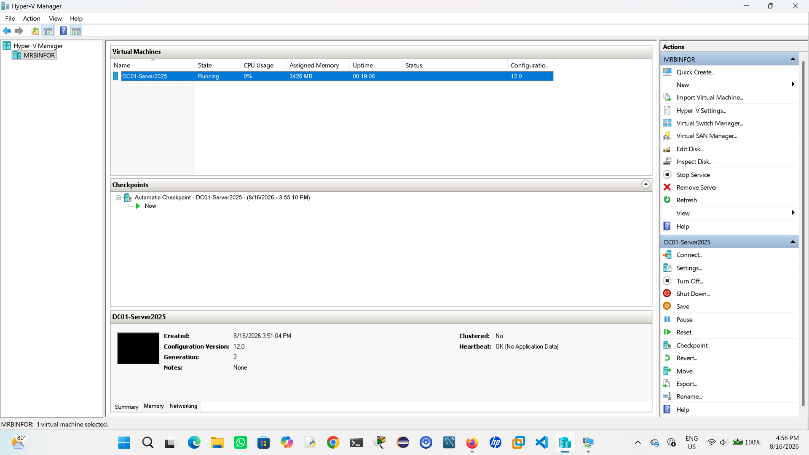
*Hyper-V Manager showing the DC01 virtual machine*

### 2. Virtual Networking
- Initially configured an External Virtual Switch bound to a physical NIC
- Switched to Hyper-V's built-in **Default Switch** after connectivity issues on the external switch — Default Switch provides NAT-based internet access with less host-side configuration overhead, well suited for an isolated lab environment

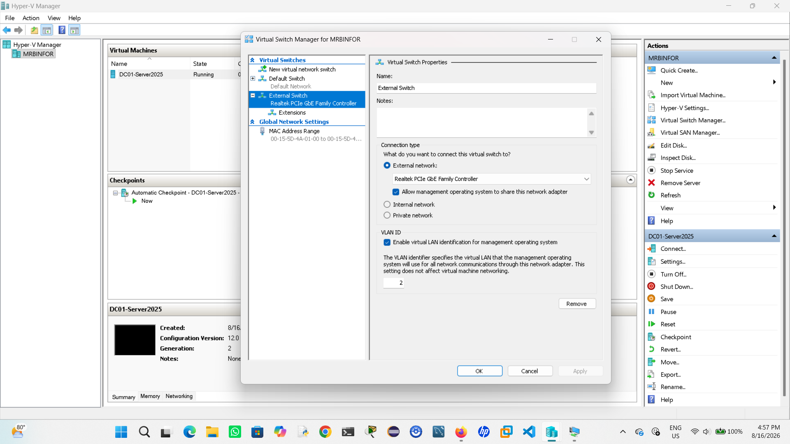
*Virtual Switch Manager configuration*

### 3. VM Provisioning
- Created a Generation 2 VM (60GB dynamically expanding disk, 4GB RAM)
- Attached the Windows Server 2025 ISO and completed a clean install with Desktop Experience

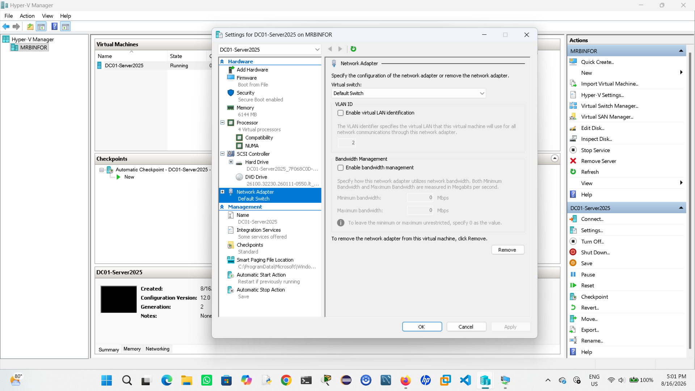
*VM settings — Generation 2, network adapter configuration*

### 4. Networking Configuration
- Identified the correct subnet, gateway, and mask assigned by Default Switch's DHCP before converting to a static IP (avoided hardcoding a mismatched external-network IP scheme)
- Renamed the server to `DC01`
- Locked in a static IP matching the DHCP-leased address/subnet/gateway to prevent IP drift

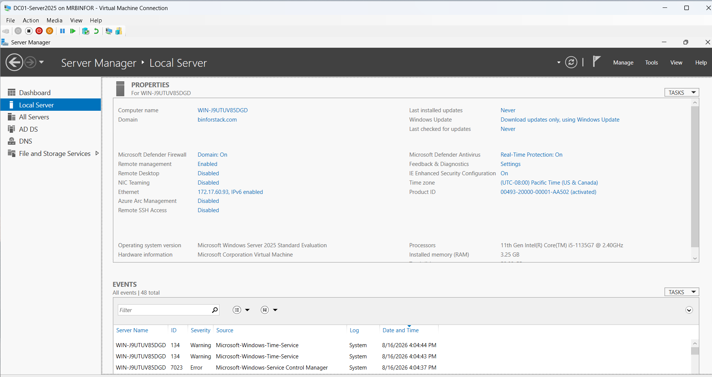
*Server Manager, Local Server — computer name and network config*

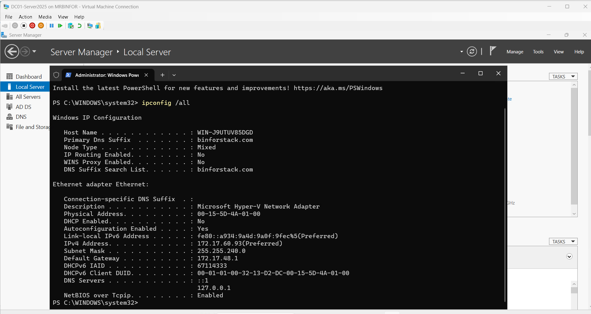
*Static IP, subnet mask, gateway, and DNS confirmed*

### 5. Active Directory Domain Services
- Installed the AD DS server role
- Promoted the server to a domain controller, creating a new forest and root domain: `binforstack.com`
- DNS Server role was installed automatically as part of promotion

### 6. Verification
- After promotion, updated the DC's preferred DNS server to `127.0.0.1`, pointing it at itself now that the DNS role was active
- Validated the domain, core services, and DNS self-resolution using PowerShell diagnostics

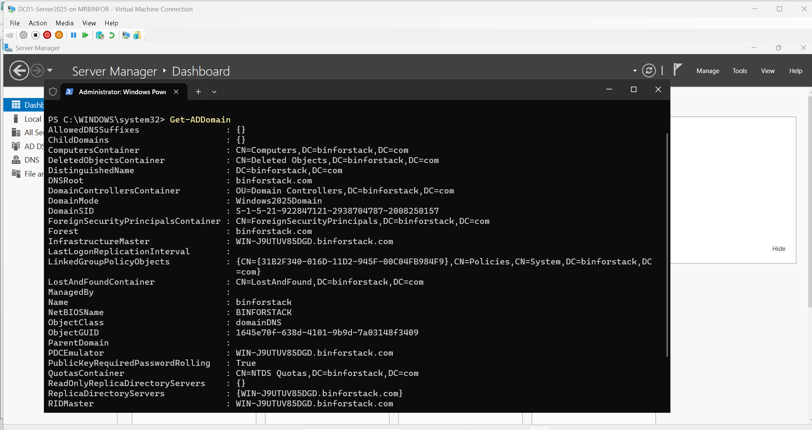
*Confirming the domain is live*

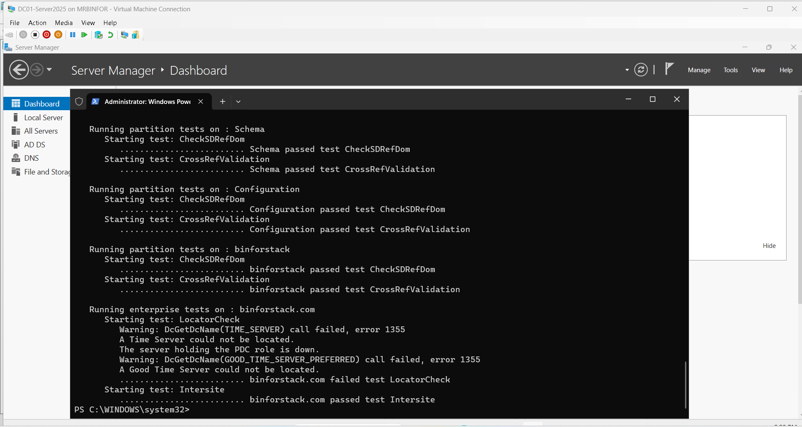
*Domain controller diagnostics passing*

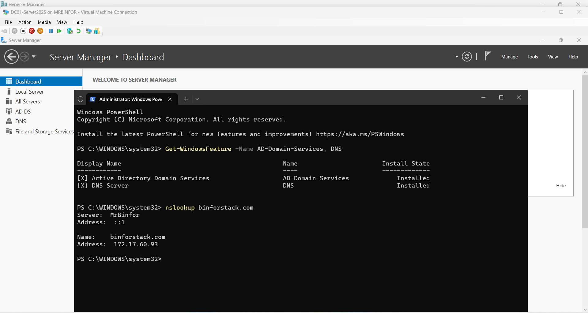
*AD DS/DNS roles confirmed installed, and DNS self-resolution verified for binforstack.com*

### 7. Organizational Unit Structure
- Built a custom OU hierarchy alongside the default AD containers, since Group Policy can only be linked to OUs, not to the built-in `Users`/`Computers` containers
- Structure:
  ```
  binforstack.com
  ├── Departments
  │   ├── IT
  │   ├── HR
  │   └── Sales
  ├── Company Staff
  ├── Company Computers
  └── Groups
  ```
- Created test user accounts across each department OU
- Created security groups (`IT-Staff`, `HR-Staff`, `Sales-Staff`) in the Groups OU and populated membership

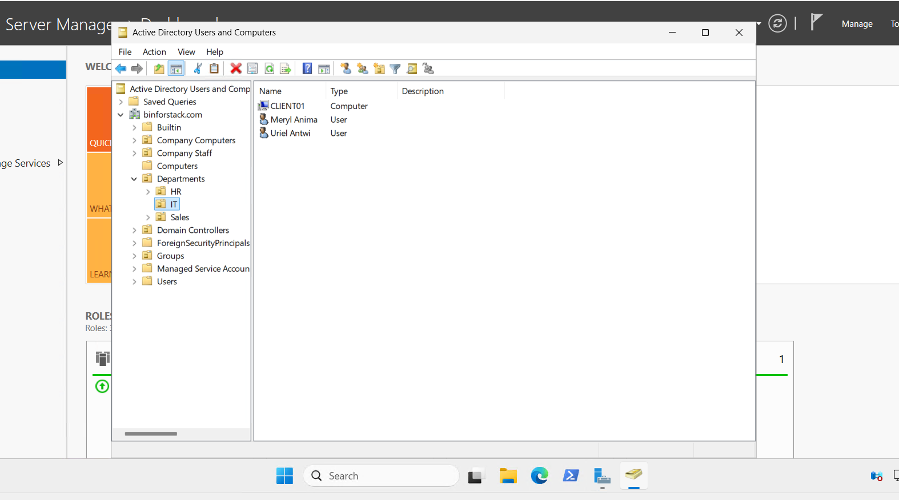
*Custom OU hierarchy alongside default AD containers*

### 8. Group Policy Object
- Created and linked a GPO (`IT-Logon-Banner`) scoped specifically to the `IT` OU
- Configured a Computer Configuration policy (Interactive Logon message title/text) under Security Options — demonstrating OU-scoped policy targeting rather than a blanket domain-wide policy

### 9. Client Domain Join
- Provisioned a second VM (`CLIENT01`, Windows 10) on the same Default Switch network
- Verified DNS/network reachability to the DC before attempting the join
- Joined the client to `binforstack.com`, authenticated with a domain test account
- Moved the client's computer object from the default `Computers` container into the `IT` OU to bring it into scope for the `IT-Logon-Banner` GPO

### 10. End-to-End Policy Verification
- Ran `gpupdate /force` on the client and confirmed the logon banner rendered at the sign-in screen before any credentials were entered
- Confirmed via `gpresult /r` (run elevated, required for the Computer Settings section to display) that `IT-Logon-Banner` appears under Applied Group Policy Objects, alongside the correct OU path (`OU=IT,OU=Departments,DC=binforstack,DC=com`)

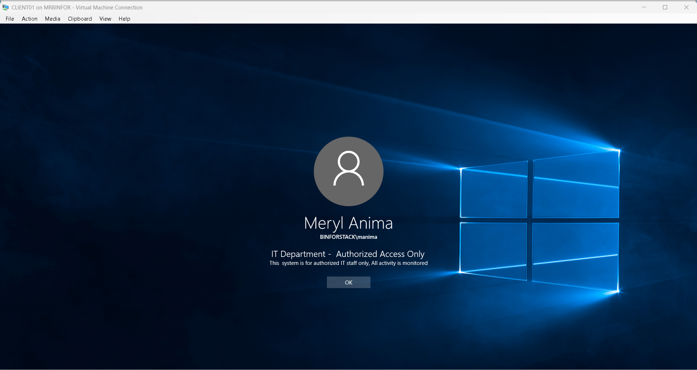
*IT-Logon-Banner GPO rendering at the sign-in screen — proof of OU-scoped policy enforcement*

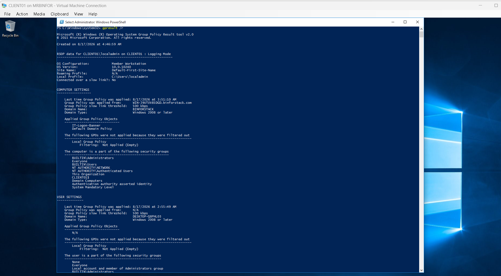
*Elevated gpresult /r confirming IT-Logon-Banner applied under Computer Settings*

## Verification Steps

```powershell
# Confirm the domain is live
Get-ADDomain

# Confirm core services are running
Get-Service -Name NTDS, DNS, Netlogon

# Confirm roles are installed
Get-WindowsFeature -Name AD-Domain-Services, DNS

# Full health check
dcdiag

# Confirm DNS self-resolution
nslookup binforstack.com

# From the client: confirm applied Group Policy (run elevated for Computer Settings)
gpresult /r

# From the client: confirm domain trust relationship is healthy
Test-ComputerSecureChannel -Verbose
```

## Troubleshooting Notes

A real issue encountered and resolved during the build: after switching from an External Switch to the Default Switch, a previously configured static IP (set for the external network's subnet) was still applied — causing complete loss of connectivity, since that address didn't exist on the new NAT subnet. Resolved by reverting to DHCP, identifying the correct Default Switch subnet, and reapplying static configuration that matched.

This reflects a common real-world scenario: network configuration must match the actual network the machine is attached to, not the one it was previously on — especially relevant when switching hypervisor networking modes.

**Subnet drift after host reboot.** The same class of issue resurfaced later, triggered differently: a Windows Update-driven host reboot caused Hyper-V's Default Switch to reissue a new NAT subnet entirely (`172.17.x.x` → `172.25.x.x`). Both the DC's static IP and the DNS forwarder (which had been pointed at the old subnet's gateway) broke simultaneously. Resolved by temporarily reverting to DHCP to observe the new subnet, then reapplying static configuration and updating the DNS forwarder to a fixed external address (`8.8.8.8`) rather than the NAT gateway IP, which removes that fragility going forward. Lesson: on NAT-based virtual switches, static configuration tied to the switch's dynamic subnet should be re-verified after any host-level reboot, and DNS forwarders should point to stable external addresses, not virtual gateway IPs.

**Client authentication failure after DC IP change.** Once the DC's IP changed, the domain-joined client could no longer authenticate ("no logon servers available"), since its DNS was still pointed at the DC's old address. Recovered by signing in with a local account (bypassing domain auth entirely) to fix the client's DNS setting without needing the DC reachable first. Also encountered a related secure channel/trust issue after the client was disconnected from the DC for a period, verified and would have repaired via `Test-ComputerSecureChannel -Repair` if needed. This highlighted the layered dependency chain in AD environments: DNS resolution, network reachability, time synchronization (Kerberos requires clocks within 5 minutes), and secure channel trust all have to hold simultaneously for domain authentication to succeed — a failure in any one produces authentication errors that look identical from the surface.

## Next Steps

- [ ] Configure DHCP scope for automatic client addressing
- [ ] Add a Reverse Lookup Zone to clean up DNS reverse resolution
- [ ] Explore additional GPOs (password policy, drive mapping, software restriction)
- [ ] Add a second client VM to test GPO scoping against a different OU (e.g. HR)
- [ ] Document network topology diagram

## Skills Demonstrated

- Hyper-V installation and virtual networking (External vs. Default Switch, NAT)
- Windows Server 2025 deployment (Generation 2 VM, UEFI)
- Active Directory Domain Services: forest/domain creation, promotion
- DNS Server role configuration and self-resolution
- Static IP configuration and subnet troubleshooting
- Organizational Unit (OU) design and Group Policy scoping
- Group Policy Object creation and targeted enforcement
- Domain join, computer object management, and OU placement
- DNS forwarder configuration
- Kerberos authentication dependencies (DNS, time sync, secure channel trust)
- PowerShell-based administration and diagnostics (`Get-ADDomain`, `dcdiag`, `Get-Service`, `gpresult`, `Test-ComputerSecureChannel`)

